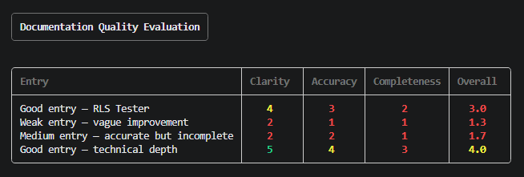

# Doc Quality Evaluator

Generating documentation is the easy part. Knowing whether it's actually good 
is the hard part.

This is an LLM-as-judge eval framework that scores technical documentation on 
clarity, accuracy, and completeness — with specific, actionable reasoning for 
every score. Not just "this is bad." Exactly what's missing and why.

Built as part of a portfolio series inspired by [Doc Holiday](https://doc.holiday) 
by Sandgarden.

## Why this exists

Anyone can prompt Claude to write docs. The question Sandgarden is actually 
solving is: how do you know if the output is any good? How do you catch subtle 
failures before users do?

This is one answer to that question.

## How it works

Each piece of documentation gets scored 1-5 on three dimensions:

- **Clarity** — could a developer act on this immediately, or would they have 
  to go hunting?
- **Accuracy** — does it match what actually changed, with specific names, 
  flags, and values?
- **Completeness** — would a user still have questions after reading this?

A second Claude call acts as the judge, applying a structured rubric and 
returning scores with one-sentence reasoning per dimension. The output is 
a color-coded terminal table plus a JSON file you can diff across runs.

## The output


Green = 4.5+, Yellow = 3.5+, Red = below 3.5.

Results are saved to `results/` as JSON so you can track quality over time 
and catch regressions.

## Stack

- Python 3.14
- Claude Sonnet (Anthropic) as the judge
- Rich for terminal output

## Setup

```bash
git clone https://github.com/boncz/doc-quality-evaluator
cd doc-quality-evaluator
pip install anthropic python-dotenv rich
```

Add a `.env`:
```bash
ANTHROPIC_API_KEY=your_key_here
```
Then:
```bash
python runner.py
```

## Bring your own docs

The sample entries in `runner.py` are real changelog entries from the 
[Changelog Generator](https://github.com/boncz/changelog-generator) — 
the first project in this series. Swap them out for any documentation 
you want to evaluate.

## What's next

- **Wire it to the changelog generator** — score every generated changelog 
  automatically and surface quality regressions before they ship
- **Trend tracking** — compare scores across runs to catch when output 
  quality degrades after prompt changes
- **Weighted scoring** — let teams prioritize accuracy over completeness 
  (or vice versa) based on their doc standards

## This is part of a series

- **[Changelog Generator](https://github.com/boncz/changelog-generator)** — RAG-powered release notes from raw git commits
- **Doc Quality Evaluator** ← you are here
- **[doctools-mcp](https://github.com/boncz/doctools-mcp)** — MCP server exposing doc tools to AI agents